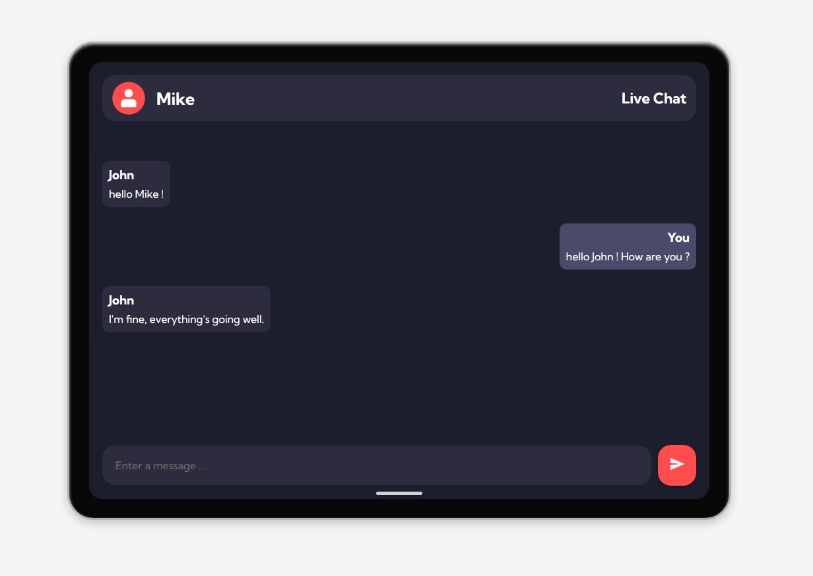
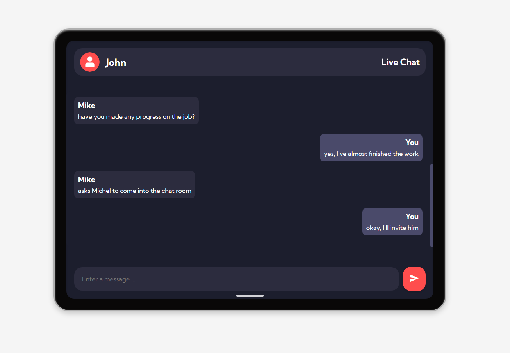
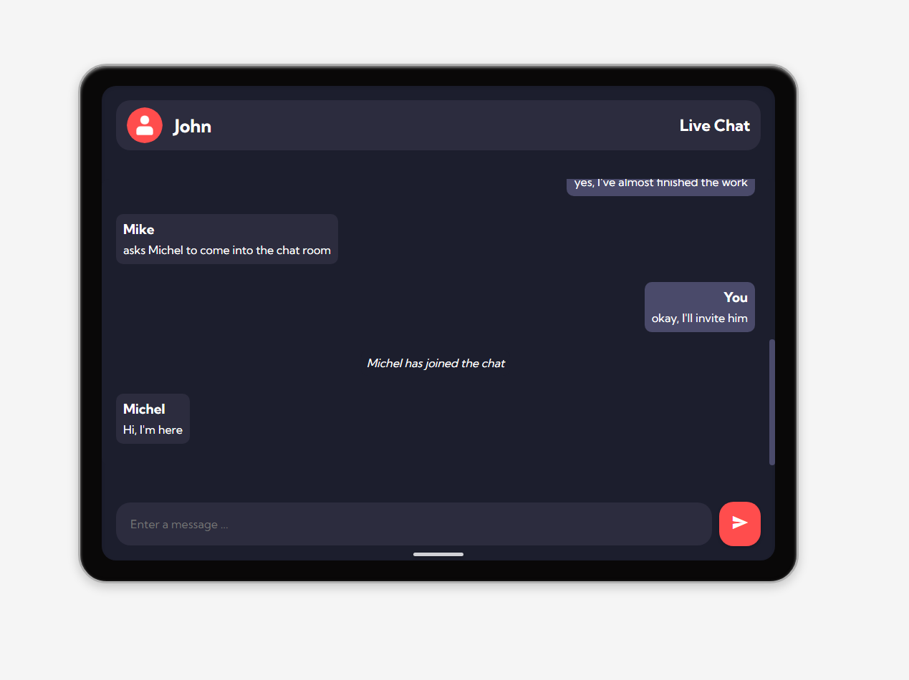
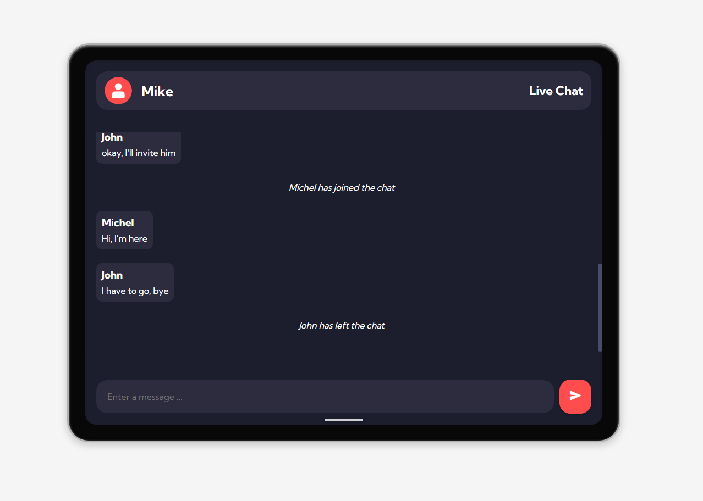
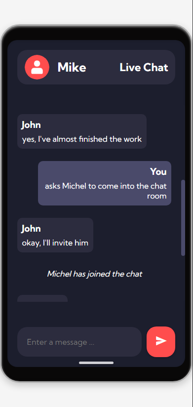

# Real-Time Web Chat Application

Welcome to the **Real-Time Web Chat Application**, a modern, feature-rich web application enabling users to communicate seamlessly in real-time. Built with **Angular**, **Socket.IO**, and **Node.js**, this application delivers a responsive, dynamic, and interactive chatting experience.

## **Table of Contents**

- [Overview](#overview)
- [Features](#features)
- [Screenshots](#screenshots)
- [Technologies Used](#technologies-used)
- [Getting Started](#getting-started)
- [Future Enhancements](#future-enhancements)
- [Author](#author)
- [License](#license)


## **Overview**

Explore the default interface of the Real-Time Web Chat Application:




## **Features**

### **1. Real-Time Messaging**
- Instantly send and receive messages with other connected users.
- Messages are displayed chronologically to ensure smooth communication.

### **2. Scrollable and Stylish Chat Interface**
- The chat interface includes a scrollable message area with a sleek, modern scrollbar.
- The interface adjusts dynamically to accommodate long conversations without affecting the rest of the layout.

### **3. Multi-User Chat Support**
- Multiple users can join the chat simultaneously.
- Each user sees messages in real-time as they are sent.
- Distinct visual identifiers for your own messages (marked as "You") and messages from others.

### **4. Connection Management**
- New users joining the chat are announced to everyone.
- When a user disconnects, a system message is displayed to inform others.
- Connection and disconnection messages are displayed chronologically within the chat.

### **5. Responsive Design**
- Optimized for both desktop and mobile devices.
- The application maintains a consistent and visually appealing layout on all screen sizes.

## **Technologies Used**

- **Frontend**: Angular (TypeScript, HTML, CSS)
- **Backend**: Node.js with Socket.IO
- **Styling**: Custom CSS with modern scrollbars and responsive design

## **Screenshots**

### **Stylish Scrollable Chat**


### **Multi-User Support**


### **User Disconnection Management**


### **Mobile View**


## **Getting Started**

### **1. Clone the Repository**
```bash
https://github.com/yourusername/realtime-chat-app.git
```

### **2. Install Dependencies**
#### **Frontend**
Navigate to the `frontend` folder:
```bash
cd frontend
npm install
```

#### **Backend**
Navigate to the `backend` folder:
```bash
cd backend
npm install
```

### **3. Run the Application**
#### **Frontend**
```bash
npm start
```
This will start the Angular development server. Visit [http://localhost:4200](http://localhost:4200) in your browser.

#### **Backend**
```bash
node server.js
```
This will start the Node.js server on [http://localhost:3000](http://localhost:3000).


## **Future Enhancements**
- **Private Messaging**: Enable one-on-one private conversations.
- **Themes**: Allow users to customize the chat interface theme.

## **License**
This project is licensed under the MIT License. See the [LICENSE](LICENSE) file for details.

## **Author**
This application was created and maintained by **Akram Lourhmati**.


